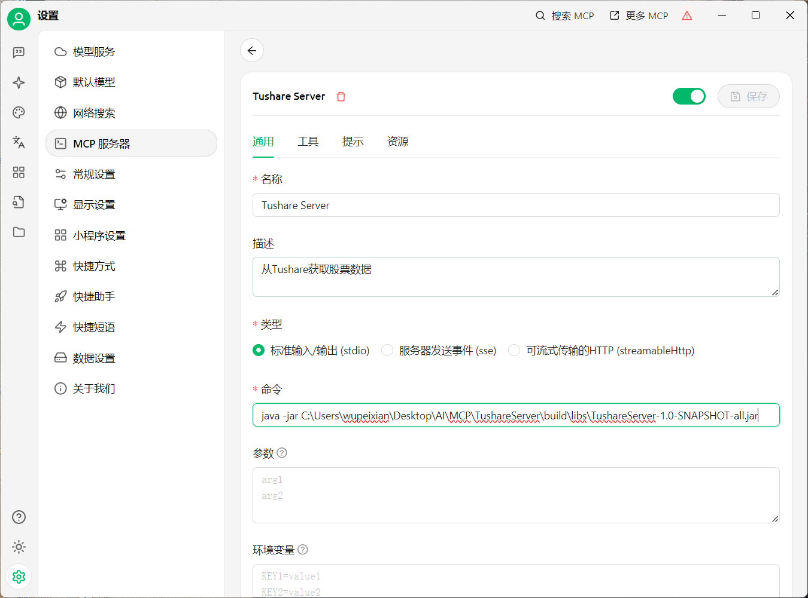
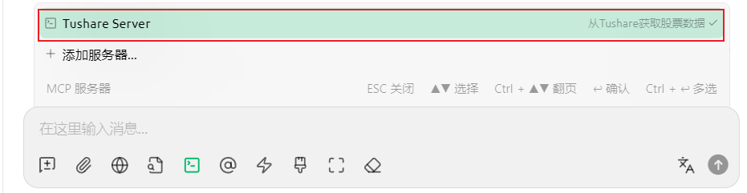

## 💻 **System Requirements**
- **Mandatory Components**
  - Java 17 or later
  - Python 3.10 or later
- **Python Dependencies**
  ```bash
  pip install fastapi tushare uvicorn
  ```
- **Cherry Studio**
  - Latest version required ([Download](https://docs.cherry-ai.com/cherry-studio/download))

---

## 🚀 **Launch Tushare Service**

1. **Obtain API Token**
  - Register at [Tushare Pro](https://tushare.pro/)
  - Retrieve API token from user dashboard

2. **Server Configuration**
   ```python
   # tushare_server.py
   token = "your_token"  # Replace with actual token
   ```

3. **Start Service**
   ```bash
   uvicorn tushare_server:server.app --reload
   ```

---

## 🏗️ **Build MCP Service**

```bash
# 1. Clone repository
git clone https://github.com/example/repo.git

# 2. Open project in IntelliJ IDEA  
# 3. Build project (choose either method)
   - Option 1: Click "build" task in Gradle panel  
   - Option 2: Command line execution  
     ./gradlew build
```

---

## 🔌 **Cherry Studio Configuration**

1. Start MCP service before connecting
   
   
